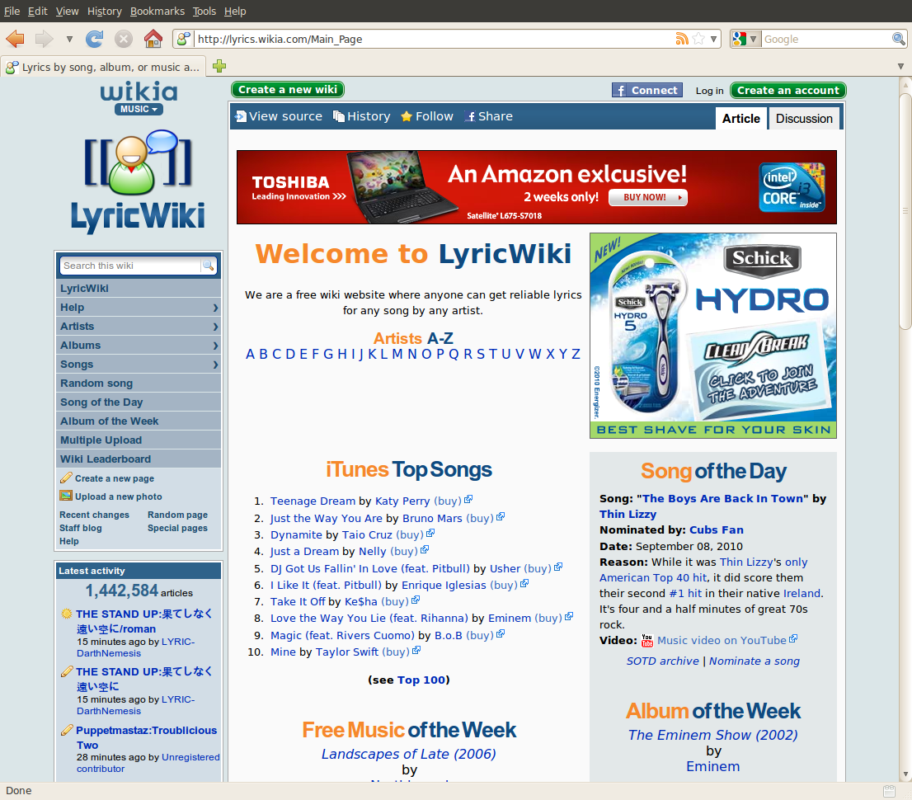

!SLIDE
# Wikia: The Road to Active/Active#

!SLIDE

# Jason Cook
## jasonc@simpleideas.org
## github.com/macros
## twitter.com/macros
## freenode #macros

!SLIDE center

# 

!SLIDE 

# 300,000+ Wikis

!SLIDE center

# 

!SLIDE

# 10s of Millions of Articles

!SLIDE center

# 

!SLIDE 

# Passionate Communities

!SLIDE center

# 

!SLIDE

# 246 Languages

!SLIDE center

# 

!SLIDE

# 45+ Million Monthly Visitors

!SLIDE center

# 

!SLIDE center

# Free Software 

# 

## http://trac.wikia-code.com

!SLIDE center

# Free Content

# 

!SLIDE

# We're Hiring #
## Just like everyone else :) ##

!SLIDE

# Active/Active? #
## ( Not Master/Master )

!SLIDE

# MediaWiki #

!SLIDE

# Out of the box scaling #
## ( To one location anyways ) ##

!SLIDE bullets

# Things mediawiki does #
* Master/Slave
* Read after write
* Direct cache invalidation
* Mostly awesome caching

!SLIDE

# Some things to know about wikia #

!SLIDE

# 94% page cache hit rate #
# 1-5% Logged in
# 99% of pages won't trigger a write

!SLIDE

# But not static content #

!SLIDE

# Wikia in 2007
## Single Location ##
## Single Provider ##

!SLIDE

# Then they screwed up #

!SLIDE

# Easy get another provider #

!SLIDE

# But the DC still a SPOF #

!SLIDE

# In an earthquake zone #

!SLIDE

# So on to DR #

!SLIDE

# FULL DR Site #
## In a nuclear bunker ##
## In the middle of nowhere ##

!SLIDE

# Big Cost #
## Everything now purchased 2x

!SLIDE 

# Big disasters hedged #
## The MTTR kinda sucks though ##

!SLIDE

# So how do we get the traffic there? #

!SLIDE

# GeoDNS #

!SLIDE

# Varnish #
    @@@ c
    if (!req.backend.healthy || req.restarts > 0) {
      set req.backend = iowa_varnish;
    } 

!SLIDE

# MTTR is better #
## Redirects between DC happen without failing requests ##

!SLIDE

# The DR site is now caching, but what about serving #

!SLIDE

# MediaWiki read-only mode #
## Degrade, but don't tell anyone until they change something ##

!SLIDE

# Great, but now we've got new problems #

!SLIDE

# Global Whack-a-mole

!SLIDE

# Cold caches #

!SLIDE

# Global cache coherency

!SLIDE
# Varnish
# Purges pushed to a queue
# Processed worldwide in under 1s

!SLIDE 

# Memcache

!SLIDE bullets
* A temp failure happens
* Traffic to the backup
* Memcache caches
* Page is changed
* Next failover returns stale

!SLIDE bullets
* Collect updates/deletes in a page render
* Write to a mysql blackhole table
* Executed in remote dc temporally with mysql updates

!SLIDE
# DR is covered, now what can we do for logged in users

!SLIDE
# Use idle apaches to render for geo directed users

!SLIDE
# DB Shim
## Some GETS trigger writes
## HTTP error sending request back to primary

!SLIDE
# Cookie after write

!SLIDE
# Don't forget to maintain 2X capacity

!SLIDE

# Thanks! #

## jasonc@simpleideas.org
## twitter.com/macros
